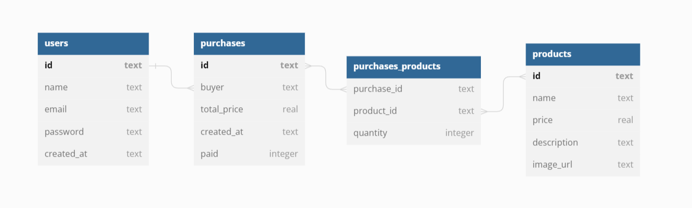

# Projeto Labecommerce Back-end

> Status: Em desenvolvimento ⚠️

<br>Projeto de criação de API com funcionadades CRUD integradas a produtos, usuários e compras implementados a biblioteca de dados em SQL.

<a href="https://documenter.getpostman.com/view/25826606/2s93XvWQq5">Link da documentação da API</a>

### Estruturação do banco de dados

<br>



### Requisitos funcionais:

- [x] Cadastro de usuário
- [x] Cadastro de produtos
- [x] Cadastro de compras
- [x] Visualizar usuários cadastrados
- [x] Visualizar produtos cadastrados
- [x] Visualizar compras cadastradas, junto com dados do usuário que realizou a compra e informações dos produtos adicionados
- [x] Editar informações do usuário
- [x] Editar informações do produto
- [x] Deletar usuário
- [x] Deletar produto

### Funcionalidades em desenvolvimento:

- [ ] Testes unitários
- [ ] Deploy

### Tecnologias utilizadas:

<table>
<tr>
<td>Node.js</td>
<td>Typescript</td>
<td>Express</td>
<td>Knex</td>
<td>Sqlite3</td>

</tr>
<tr>
<td>8.19.3</td>
<td>5.0.2</td>
<td>4.18.2</td>
<td>2.4.2</td>
<td>5.1.6</td>
</tr>
</table>

## Como rodar a aplicação

```ubuntu
# Clone este repositório
$ git clone linkrep

# Acesse a pasta do projeto no seu terminal

# Instale as dependências
$ npm install

# Execute a aplicação no servidor
$ npm run dev

# A aplicação será iniciada na porta 3003

# Use algum API Client para testar as rotas da aplicação
```

### Contato:

e-mail: lnataliaperri@gmail.om

[](https://www.linkedin.com/in/natalia-perri/)
